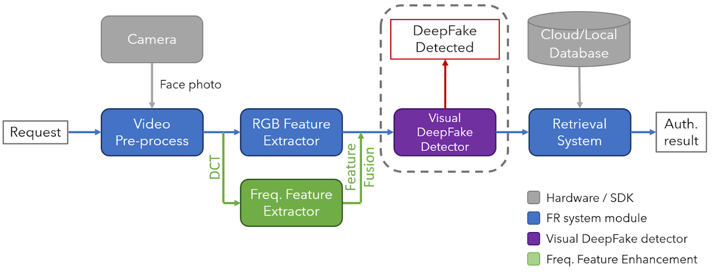
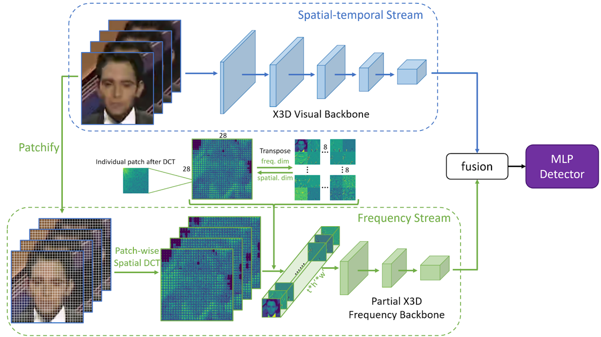

# Protect Face Recognition Systems against Various Attacks

## Introduction

The rapid development of deep learning methods enables generation of fake images and videos. As one of the most impressive topics in the field, Deepfake has gained a lot of attention over the years. However, the malicious use of videos with fake faces generated by Deepfake, such as to defame or attract face recognition systems, raises serious social and security concerns. To address this issue, our project aims to propose a novel and easy-to-use Deepfake video detection toolkit and improve the generalization capabilities of the current state-of-the-art methods. Specifically, we propose a learning framework based on a two-stream network, combined with spatial-temporal and frequency models. The spatial-temporal model, which is based on X3D visual backbone, captures the RGB feature based on the spatial-temporal stream. The frequency model extracts frequency features by applying patch-wise Discrete Cosine Transform (DCT) operation. Extensive experiments on the Faceforensics++ dataset show that our method out-performs the state-of-the-art face forgery detection methods.

  

## Dependencies and Installation

* Python 3 (Recommend to use [Anaconda](https://www.anaconda.com/download/#linux))
* [PyTorch &gt;= 1.0](https://pytorch.org/)
* NVIDIA GPU + [CUDA](https://developer.nvidia.com/cuda-downloads)
* Python packages: `pip install -r requirements.txt`
